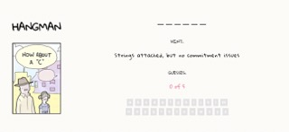

# Hangman Game

## Description 

Game built with html, css and javascript.

## How to play

remember the good old days of hangman? when all you needed was a scrap of paper and a pen? use the keyboard to guess the letters one by one before the poor guy gets hanged.

## Demo

https://camilaflorez-dev.github.io/hangman/

## MVP'S

    * blank word as lines, represent of the number of letters in the word.
    * Allow the player to guess one letter at a time.
    * Give a feedback on whether the selected letter is in the word or not.
    * Display the guessed letters if is correct.
    * Limit the player to a certain number of guesses.
    * Display a win or lose message based on the outcome of the game.
    * Incorporate a list of words to be used in the game.	

## To improve

    * responsive design. 
    * Adding different categories like animals, countries ...
    * Difficulty levels.
    * Incorporating sound effects to make the game more engaging (saw).
    * score tracking.	

